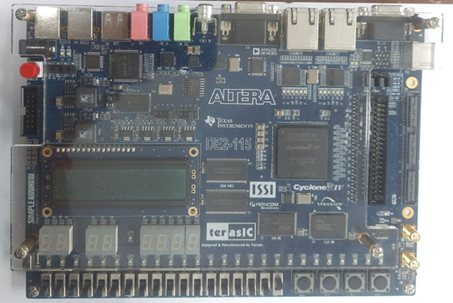

# FPGA-Based-Digital-Controller

The realization of the digital controller can be done using a microcontroller, a DSP, or an FPGA. The FPGA provides a parallel computing platform, enabling fast processing of the input variables so that the output can be provided in real time. In this project, the realization of the controller's transfer function is implemented on the FPGA. To observe the controller's output, a DAC interface was necessary so that the output (corresponding to, say, a given step input) could be viewed on an oscilloscope. An I2C DAC was programmed for this purpose. However, to provide inputs to the controller, an ADC is required. The inputs can include a reference value and a feedback value from a sensor (voltage/current/temperature).

This project includes the design and implementation of a digital controller on **Altera Cyclone II EP2C5T144I8N/Cyclone IV EP4CE115F29C7N FPGA.** Verilog HDL has been used for the design and implementation of the controllers. The programming and simulations have been done in Quartus II 13.0 and ModelSim-Altera 10.1d.

## I2C Protocol

To see the output generated by the FPGA on an oscilloscope, it needs to be converted into analog signal using a DAC. For this purpose, MCP4725, an I2C based DAC is used. To interface it with the FPGA, an I2C controller core needs to be developed in Verilog as per the standards of the protocol. I2C stands for Inter Integrated Circuit and is a serial communication protocol. It is a 2-wire communication protocol, using just two signals, namely SDA and SCL to transfer digital data. 
